# Project Helping Hands
*Bridge the gap between users of ASL and those unfamiliar with ASL*

 

### Overview

This project is a requirement for our course Software Engineering 2 (CS 118)

This is a camera app that continuously detects the objects (bounding boxes and classes) in the frames seen by your device's back camera. These instructions walk you through building and running the demo on an Android device.

This application should be run on a physical Android device.

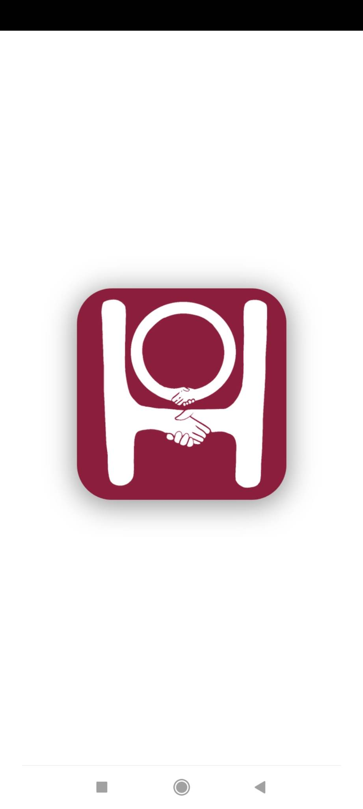&nbsp;
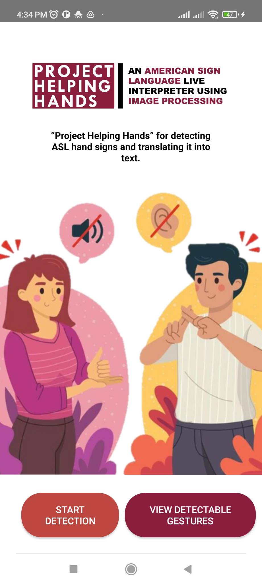&nbsp;
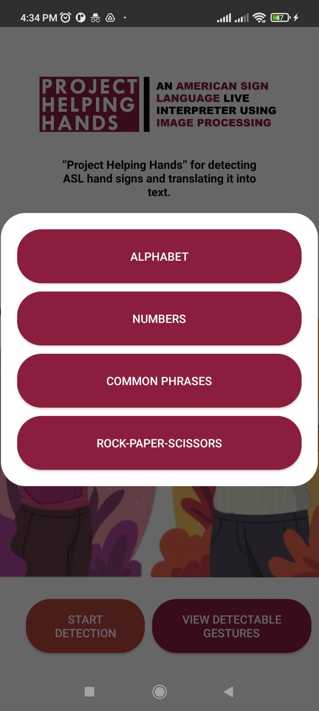

## Build the demo using Android Studio

### Prerequisites

*   The **[Android Studio](https://developer.android.com/studio/index.html)**
    IDE. This sample has been tested on Android Studio Bumblebee.

*   A physical Android device with a minimum OS version of SDK 32 (Android 12.0 -
    Snow Cone) with developer mode enabled. The process of enabling developer mode
    may vary by device. 

*   Under developer mode options, make sure the USB-debugging option is enabled if the device will be connected via cable.

### Building

*   Open Android Studio. From the Welcome screen, select Open an existing
    Android Studio project.

*   From the Open File or Project window that appears, navigate to and select
    the **/Project_Helping_Hands** directory. Click OK.

*   If it asks you to do a Gradle Sync, click OK.

*   With your Android device connected to your computer and developer mode
    enabled, click on the green Run arrow in Android Studio, or press Shift+F10.

### Models used

* **ASL Phrases** -  This model was trained with a dataset of 2,400 images that was manually captured and annotated through [labelImg](https://github.com/heartexlabs/labelImg) by the team members.

* **ASL Alphabet** -  This model was trained using this publicly available  [dataset](https://universe.roboflow.com/sign-language/american-language) by [David Lee](https://www.linkedin.com/in/daviddaeshinlee/). [This](https://universe.roboflow.com/davor-bokan/asl_cropped) dataset was also used to train the model.

* **ASL Numbers** -  This model was trained using this publicly available [dataset](https://universe.roboflow.com/ktnf749-snu-ac-kr/sign-hb57g/dataset/1) from Roboflow.

* **Rock-Paper-Scissors** -  This model was trained using this publicly available [dataset](https://universe.roboflow.com/yolorockpaperscissors/rockpaperscissors-official) from Roboflow.

&nbsp;&nbsp;&nbsp;&nbsp;&nbsp;&nbsp;**Note: All custom-models were trained with transfer learning using the pretrained model [SSD MobileNet V2 FPNLite 320x320](https://github.com/tensorflow/models/blob/master/research/object_detection/g3doc/tf2_detection_zoo.md) trained on the [COCO dataset](http://cocodataset.org/).* The jupytern notebook used to train the custom-models can be found [here](https://github.com/balanarenmar/Custom-Object-Detection-Notebook). The datasets were split with 80% of the images used for training, and the remaining 20% for testing. This Application was built with the help of [Tensorflow Examples](https://github.com/tensorflow/examples/tree/master/lite/examples/object_detection/android).

 

### User Manual
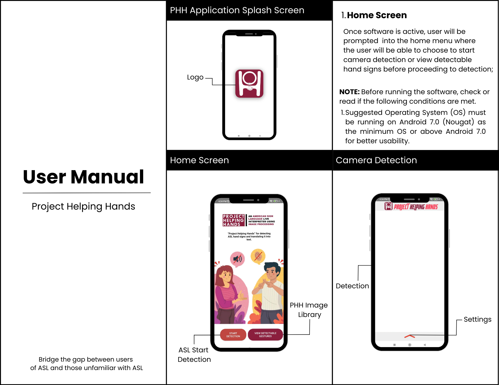 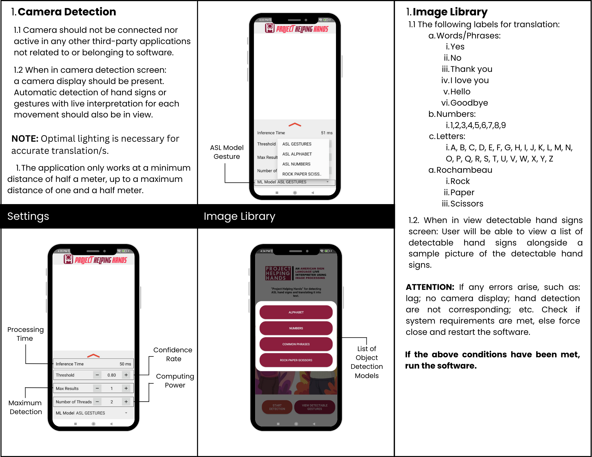

 

---

## **MEMBERS** 
##### *BSCS 3-A (2022-2023)* 

 ## • Renmar Balana &nbsp;&nbsp;&nbsp;&nbsp;&nbsp;&nbsp;&nbsp;&nbsp;&nbsp; • Xania Shane Oropesa  
&nbsp;&nbsp;&nbsp;&nbsp; &nbsp;&nbsp;&nbsp;&nbsp;&nbsp;&nbsp;&nbsp;&nbsp;&nbsp;&nbsp;&nbsp;&nbsp;&nbsp;&nbsp; 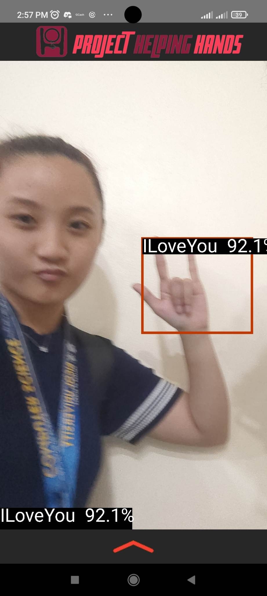 

 

 ## • Hewey James Lita &nbsp;&nbsp;&nbsp;&nbsp;&nbsp;&nbsp;&nbsp;&nbsp;&nbsp; • Jan Lance Borrero  
&nbsp;&nbsp;&nbsp;&nbsp;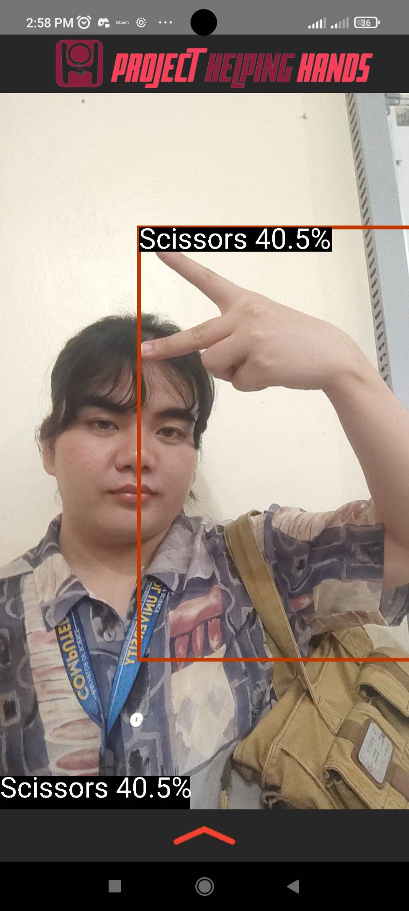 &nbsp;&nbsp;&nbsp;&nbsp;&nbsp;&nbsp;&nbsp;&nbsp;&nbsp;&nbsp;&nbsp;&nbsp;&nbsp;&nbsp; 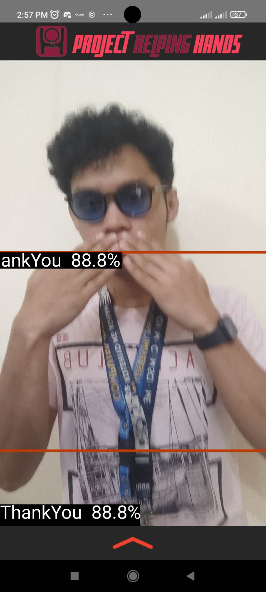 

 

## • Jiggy Brondial
&nbsp;&nbsp;&nbsp;&nbsp;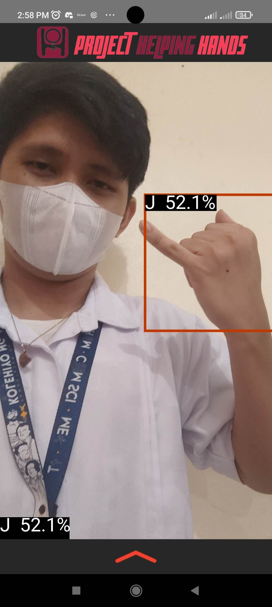

&nbsp;&nbsp;&nbsp;&nbsp;&nbsp;&nbsp;&nbsp;&nbsp;&nbsp;&nbsp;
 

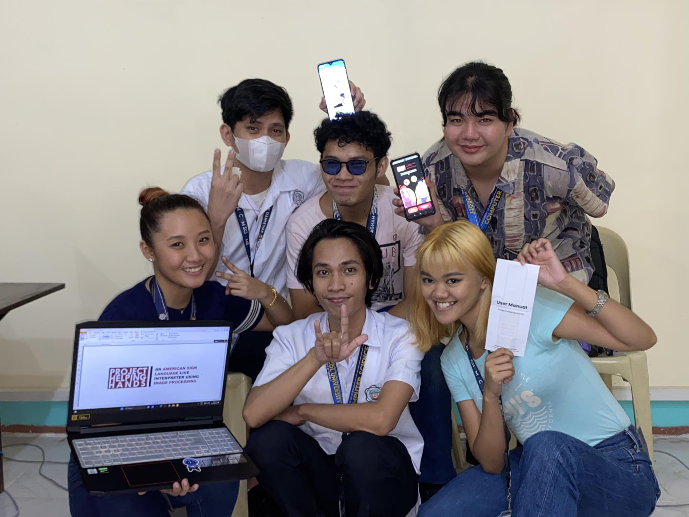 
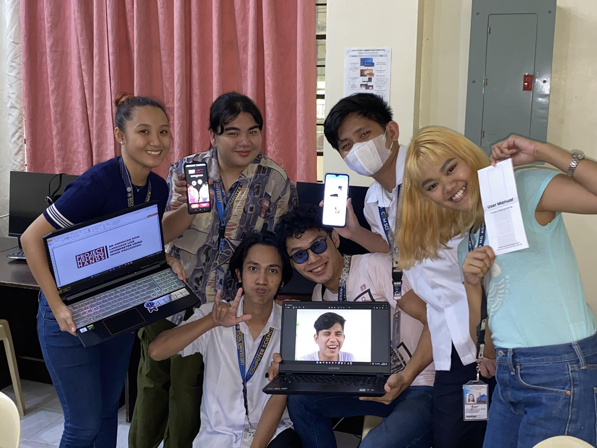
