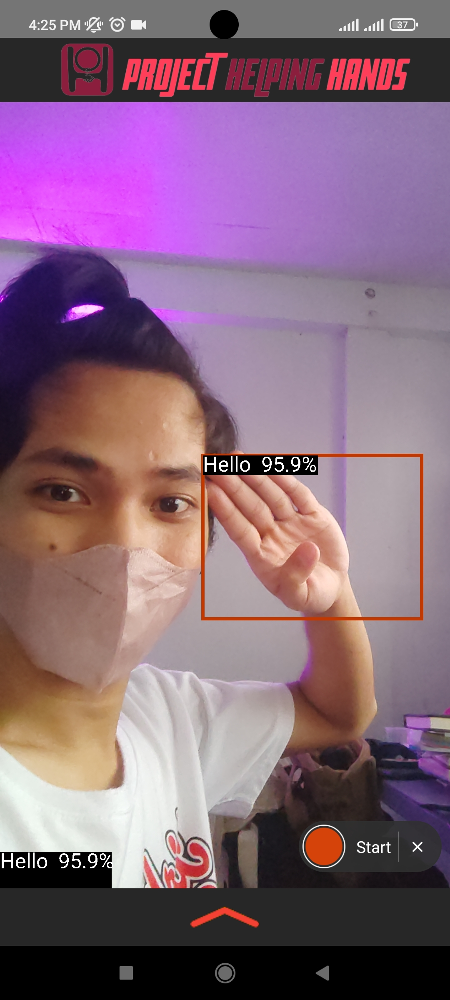
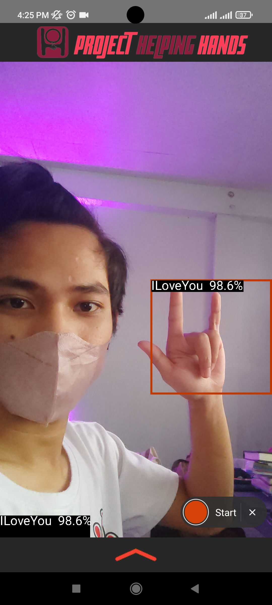

# TensorFlow Lite Object Detection Android Demo

### Overview

In partial completion for our course Software Engineering 2 (CS 118) 

This is a camera app that continuously detects the objects (bounding boxes and
classes) in the frames seen by your device's back camera. These instructions
walk you through building and running the demo on an Android device.

This application should be run on a physical Android device.

  

## Build the demo using Android Studio

### Prerequisites

*   The **[Android Studio](https://developer.android.com/studio/index.html)**
    IDE. This sample has been tested on Android Studio Bumblebee.

*   A physical Android device with a minimum OS version of SDK 24 (Android 7.0 -
    Nougat) with developer mode enabled. The process of enabling developer mode
    may vary by device.

### Building

*   Open Android Studio. From the Welcome screen, select Open an existing
    Android Studio project.

*   From the Open File or Project window that appears, navigate to and select
    the tensorflow-lite/examples/object_detection/android directory. Click OK.

*   If it asks you to do a Gradle Sync, click OK.

*   With your Android device connected to your computer and developer mode
    enabled, click on the green Run arrow in Android Studio.

### Models used

The custom-model was trained with transfer learning using the pretrained model [SSD MobileNet V2 FPNLite 320x320](https://github.com/tensorflow/models/blob/master/research/object_detection/g3doc/tf2_detection_zoo.md) trained on the [COCO dataset](http://cocodataset.org/). The custom model was trained with dataset that was manually captured and annotated through [labelImg](https://github.com/heartexlabs/labelImg) by the team members.

# MEMBERS

## Renmar Balana
## Xania Shane Oropesa
## Hewey James Lita
## Jan Lance Borrero
## Jiggy Brondial

BSCS 3-A (2022-2023)
